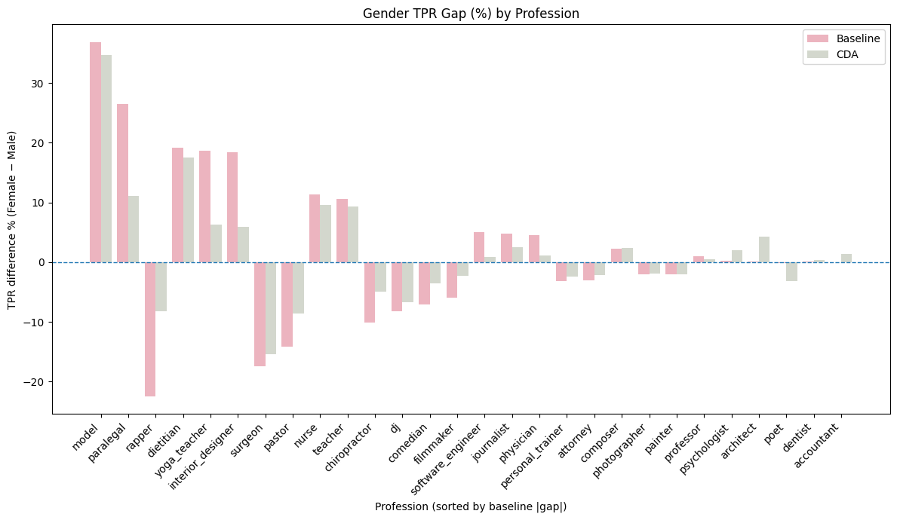

# Mitigating gender bias in LLMs

## Project Overview

My teammates and I explored methods for reducing gender bias in modern LLM architectures. We applied three distinct debiasing methods and fine-tuned a ModernBert model on the Bias in Bios dataset [(Laboratoire Hubert Curien, 2023)](https://huggingface.co/datasets/LabHC/bias_in_bios). 

### Method 1: Counterfactual data augmentation

Leveraged spaCy's dependency parser to develop an algorithm that duplicated bios from the dataset while swapping out gendered terms and masking names. This method was able to maintain the accuracy of the model (86%) while achieveing significant drop in the true positive rate gap between males and females.

### Method 2: Debiased embeddings

This involved removing gender information from embeddings while maintaining relevant semantic content by calculating the difference between the male and female forms of a given context to get the gender difference. By doing this across multiple gendered pairs and contexts, we took the average across all of them to give us the gender direction vector. With this vector, we were able to remove the gender component from the CLS tokens. This method effectively removed gender-direction cosine similarity in the embeddings while maintaining the model's performance accuracy. 

### Method 3: Iterative Nullspace Projection

The null space is the set of directions in the embedding space that a classifier cannot use to predict a target label, in this case gender. INLP trains a gender classifier on the embeddings, identifies the directions the classifier relied on, and then projects the embeddings into the classifier’s null space so those directions are removed. It repeats this process over many iterations: train a new classifier on the projected embeddings, find its null space, project again, and so on. 

With each iteration, the model distills whatever residual gender information remains, until the gender classifier can no longer do better than just random guessing. In this way, INLP generalizes debiased embeddings by systematically removing all gender-predictive structure that exists in the representation, not just the small subspace we specify ahead of time. Although this method reduced accuracy, it was the strongest method for reducing the true positive rate gap. 

## Tools

Hugging Face Transformers (ModernBert) | PyTorch | scikit-learn | spaCy

## Contributors

Christine Sako | Yoko Morishita

UC Berkeley MIDS | December 2025