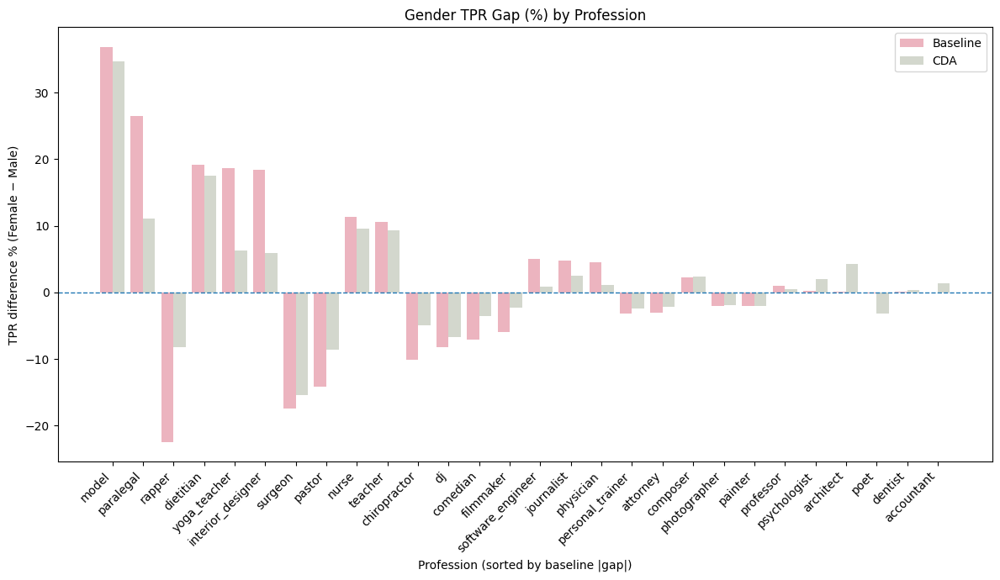
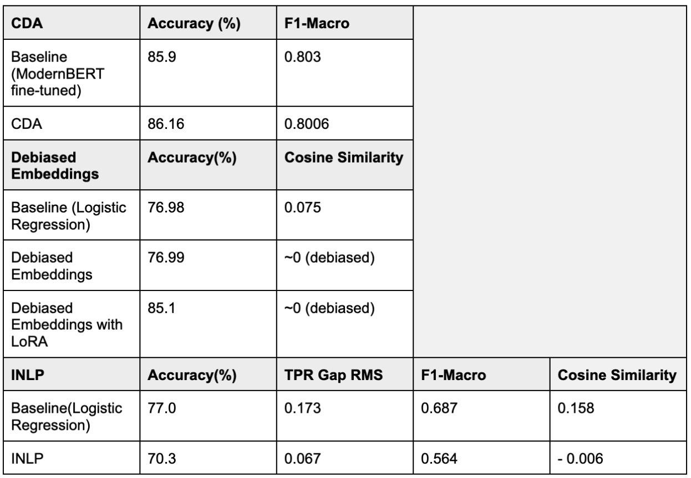

# Mitigating Bias in Modern LLMs

> Comparing three debiasing techniques — counterfactual data augmentation, embedding projection, and iterative nullspace projection — to reduce occupational gender bias in a fine-tuned ModernBERT model.

[]()
[]()

---

## Overview

Large language models are trained on vast amounts of web data that can often reflect biases towards certain groups, resulting in unfair disadvantages in downstream applications, such as resume screening tools. In the landmark paper *'Man is to Computer Programmer as Woman is to Homemaker? Debiasing Word Embeddings'*, Bolukbasi et. al. explore the impacts of this training and how models understand traditionally gendered terms. Our team explores this area further by not only applying Bolukbasi's debiased embedding method, but also counterfactual data augmentation and iterative nullsapce projection methods to modern large language models. Our aim is to explore if modern LLMs show overall less bias than older models in an occupation classification task, and which mitigation strategy results in the greatest decrease in bias. 

## Table of contents

- [Data](#data)
- [File structure](#file-structure)
- [Setup & reproduction](#setup--reproduction)
- [Methods](#methods)
- [Results](#results)
- [Key learnings](#key-learnings)
- [Contributors](#contributors)

## Data

| Dataset | Source | Description |
|---------|--------|-------------|
| Bias in Bios  | (Laboratoire Hubert Curien, 2023)[https://huggingface.co/datasets/LabHC/bias_in_bios] | Each row contains a text biography, a number representing the subject's profession, and a binary value indicating their gender. The goal is to predict the profession based on the text biography, with gender as the sensitive attribute. |

> **Note:** To load data, make sure Hugging Face Transformers is installed. See https://huggingface.co/datasets/LabHC/bias_in_bios for instructions on pulling train, dev and test data. 

```
!pip install transformers
```

## File structure

```
├── notebooks/      # analysis notebooks, run in numbered order
├── images/         # charts and figures used in the README
├── docs/           # final report and presentation PDFs
├── README.md
└── requirements.txt
```

## Setup & reproduction

```bash
# Clone the repo
git clone https://github.com/jandersen12/mitigating-gender-bias-in-LLMs.git
cd mitigating-gender-bias-in-LLMs

# Install dependencies
pip install -r requirements.txt   # Python

# Run notebooks in order
# 01_... → 02_... → 03_...
```

> **Environment:** Python 3.10. This project was completed in Google Colab using an A100 GPU. 

## Methods

### Method 1: Counterfactual data augmentation

- Leveraged spaCy's dependency parser to develop an algorithm that duplicated bios from the dataset while swapping out gendered terms and masking names.
- Maintained 86% accuracy while achieveing significant drop in the true positive rate gap between males and females.

### Method 2: Debiased embeddings

- Removed gender information from embeddings while maintaining relevant semantic content by calculating the difference between the male and female forms of a given context to get the gender difference. 
- Took the average across across multiple gendered pairs and contexts to give us the gender direction vector. 
- Used this vector to remove the gender component from the CLS tokens. 
- Effectively removed gender-direction cosine similarity in the embeddings while maintaining the model's performance accuracy. 


### Method 3: Iterative Nullspace Projection

- The null space is the set of directions in the embedding space that a classifier cannot use to predict a target label. INLP iteratively trains a gender classifier on the embeddings, identifies the directions the classifier relied on, and then projects the embeddings into the classifier’s null space so those directions are removed. 
- INLP generalizes debiased embeddings by systematically removing all gender-predictive structure that exists in the representation, not just the small subspace we specify ahead of time. 
- This method reduced the accuracy of the model, but was the strongest method for reducing the true positive rate gap. 

📄 [Full report (PDF)](docs/project-report.pdf)

## Results





## Key learnings

- Through this project I gained a robust understanding of transformer architectures, embeddings, and vector spaces. I also experimented with LoRa/PEFT to optimize the fine-tuning stages of the project.
- In the future, I would expand on this project by overlapping multiple mitigation strategies to try and optimize for different fairness measures, such as multi-direction bias.

## Contributors

Christine Sako | Yoko Morishita

UC Berkeley MIDS | December 2025
